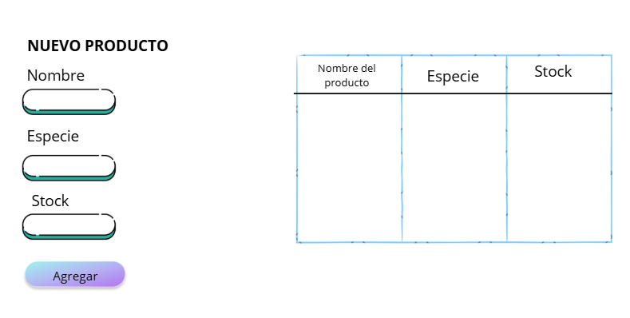

# 🐾 Sistema de Inventario Veterinaria - Solana (Anchor)

Este proyecto es una aplicación descentralizada (dApp) desarrollada sobre la blockchain de **Solana** utilizando el framework **Anchor**. El sistema permite gestionar un inventario de productos veterinarios de manera segura, transparente e inmutable.

## 🚀 Información del Proyecto
* **Desarrollador:** Angel Perez
* **Institución:** Universidad Politécnica de Atlacomulco (UPA)

## 🛠️ Tecnologías Utilizadas
* **Rust & Anchor:** Lógica del Smart Contract (Program).
* **TypeScript:** Cliente de pruebas e interacción.
* **Solana CLI:** Despliegue en Devnet.
* **Solana Playground:** Entorno de desarrollo.

---

## 📂 Estructura del Repositorio
* `src/lib.rs`: Contrato inteligente con funciones CRUD (Create, Read, Update, Delete).
* `tests/inventario-test.ts`: Cliente TypeScript que valida la conexión con la blockchain.
* `Anchor.toml`: Archivo de configuración del proyecto (Program ID y Network).
* `assets/`: Carpeta que contiene el diseño visual del sistema.

---

## 🎨 Diseño de Interfaz (Mockup/Wireframe)
El siguiente diseño representa la interfaz de usuario que interactúa con el programa. Permite capturar datos como nombre, especie y stock, y visualizarlos en tiempo real desde la blockchain.

---

## 📋 Funcionalidades del Contrato
1.  **Crear Inventario:** Inicializa una cuenta PDA única para el usuario.
2.  **Agregar Producto:** Inserta un nuevo registro en el vector de productos (máximo 10).
3.  **Ver Productos:** Lee y muestra los logs de los productos registrados.
4.  **Modificar Stock:** Actualiza la cantidad de un producto existente.
5.  **Eliminar Registro:** Remueve un producto específico del inventario.

---

## 🔧 Cómo Probar el Proyecto
1. Clonar el repositorio: `git clone https://github.com/tu-usuario/Inventario-solana.git`
2. Instalar dependencias: `yarn install`
3. Ejecutar pruebas: `anchor test`
